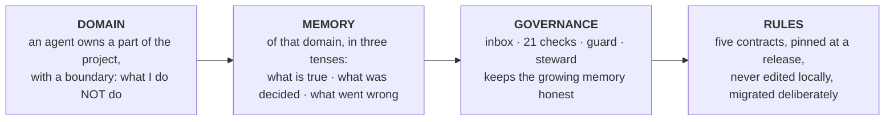

<!-- SPDX-License-Identifier: Apache-2.0 · Copyright 2026 Criticaldrop Entertainment s.r.l. -->
<div align="center">

# CritOS

### Multi-agent governance for your repository.

**Give every agent a domain, a memory and a boundary.**

[Website](https://critos.dev) · [Install](#install) · [How it works](#how-it-works) · [Guides](docs/README.md) ·
[Changelog](system/CHANGELOG.md) · [Contributing](.github/CONTRIBUTING.md) · [License](LICENSE)

[](https://github.com/CritosAI/critos/actions/workflows/tests.yml)
[](https://github.com/CritosAI/critos/releases)
[](LICENSE)
[](#requirements)
[](#what-it-is--and-what-it-is-not)

</div>

**Good agents are built by a good team. CritOS organises the agents that build your software.**

A coding agent is brilliant for one session. Your project lasts years. Between the two, things
get lost: the next session does not know what the last one decided, two agents overwrite each
other, work is declared done that is not, and the same question gets settled three times.

CritOS is a **development method** for people who build software with AI coding agents — and
the tools that keep it honest. It rests on an idea you already trust from working with people:
**a part of the system has an owner, the owner knows why things are the way they are, and that
knowledge is written down where the code lives.** Installed in minutes, guided from the first
step. Open source, plain files, in git. No telemetry.

## Why CritOS

**Agents forget. Your repo doesn't.** Every other tool gives an agent a *task* to remember. CritOS
gives it a **domain** — the billing engine, the deploy surface, the data model — and the agent
keeps the memory of that domain in your repository: what is true now, what was decided and why,
what went wrong and must not happen again. It starts every session from there, not from zero,
and it knows its domain better the longer it owns it.

**The memory lives in your repo, not in the model.** Swap the model, add a colleague, restart
tomorrow: what the agent knows is still there — in files you can read, diff, review and revert.
Nothing is hidden in a vector store or in a vendor's cloud.

**And the team stays honest.** A shared inbox where every request has one owner and stays
counted until it is closed. Twenty-one deterministic checks that tell you what is actually true.
A guard before the irreversible. A steward that proposes — and you decide.

## What you get

- **Give an agent a domain, not a role.** Not "a coder" and "a tester": an owner of the billing
  engine, an owner of the deploy surface — each with a stated boundary, *what I do NOT do*, so
  the edge of one is where the next begins. A role has nothing to remember; a domain does.
- **It keeps the memory of that domain — and knows it better the longer it owns it.** Per
  agent, one writer: what is true now, what was decided and why, what went wrong and must not
  happen again. Every session starts from there, not from zero. Plain files, in your repo,
  versioned with git: you can read, review and correct what your agent believes. And the memory
  is *managed* — a snapshot that is overwritten, logs that are aged and archived, an index that
  finds every decision — so it is still worth reading a year in.
- **Work that is handed over, never lost.** A shared inbox where a request has one owner and a
  closure criterion, and stays counted until it is closed.
- **Checks that tell you what is actually true.** Twenty-one deterministic checks: broken links
  and orphan docs, stale status, debts nobody is counting, decisions cited that no longer
  exist, a pinned rulebook that someone edited.
- **A guard.** It asks you before a `git push`, and before any git command that would sweep
  another session's uncommitted work.
- **A steward that takes you by the hand.** CritOS ships with one agent already in it. It
  interviews you, reads your repo, *measures* where the work concentrates, and proposes how to
  cut the project into domains — then it keeps the whole thing honest. It proposes; you decide.

**The team is part of the repo.** Your agents are like the modules of your codebase: each is
*defined* in the repo, keeps its *state* in the repo, and talks to the others through a declared
channel instead of reaching into their internals. They are versioned, reviewed and cloned with
the code: clone the repository on another machine and the team comes with it — who owns what,
what each one knows, what is owed.

It works with **one agent** too: you still get the memory, the checks and the guard.

## How it works

Four things, each one there because of the one before it.



1. **Domain.** An agent owns a *place* in the project, with a stated boundary. Why domains and
   not roles: memory needs a subject, and the subject is the domain.
2. **Memory — of that domain.** What is true **now** (a snapshot, overwritten) · what was
   **decided and why** (a log, append-only) · what **went wrong** and must not happen again
   (lessons, each naming how it is enforced). One folder per agent, one writer, in git.
3. **Governance — what keeps the growth honest.** An **inbox** where what an agent *owes* is
   read before what it remembers · **checks** that say whether the memory and the docs are
   actually true · a **guard** on the irreversible · a **steward** that measures the project and
   proposes the partition.
4. **Rules — pinned.** The same five contracts in every repo, pinned at a release. A rule that
   changes under you fails silently; a pinned one is checked for drift.

What lands in your repository:

```
your-repo/
├── CLAUDE.md                     routing: where an agent starts reading
├── .claude/agents/agent-1.md     the steward (installed — do not edit)
└── .critos/
    ├── system/                   the five contracts, PINNED at a release — nobody edits them here
    ├── project/                  YOUR choices: settings, the roster, the agents' definitions
    ├── memory/a<N>/              one folder per agent, one writer each: STATUS, DECISIONS, LESSONS-LEARNED
    └── shared/                   the inbox, the roadmap, the register of iron rules
```

## Requirements

- **Windows** (with **Git Bash**) or **Linux**. macOS is untested in 1.0.
- **Claude Code**, git, and Node.js (the installer and two of the checks use it).

## Install

**1 · The machine, once.** On Windows:

```powershell
git clone --branch v1.0.0 https://github.com/CritosAI/critos.git C:\tools\CritOS
cd C:\tools\CritOS
powershell -ExecutionPolicy Bypass -File .\install.ps1
```

On Linux:

```bash
git clone --branch v1.0.0 https://github.com/CritosAI/critos.git ~/tools/CritOS
cd ~/tools/CritOS
bash install.sh
```

The installer touches four things under `~/.claude`, and nothing else: one link per skill
(`skills/crit-*`), one for the guard (`hooks/critos`), **one** entry in `settings.json` that
registers the guard (a backup is written first), and **one** block in `CLAUDE.md` between CritOS
markers. `-Uninstall` / `--uninstall` removes exactly those. `-ClaudeHome <dir>` /
`--claude-home <dir>` installs into a sandbox instead.

Keep the checkout where it is: the controls run from it. Restart Claude Code afterwards.

**2 · Each repository, once.** Open Claude Code in your repo and run:

```
/crit-scaffold-project
```

It pins the rulebook into the repo, creates the skeleton and commits. Then it offers you the
steward: a short interview, a measured reading of your repo, a proposed set of agents — one is a
legitimate answer — and, once you have ruled, the drafts of their definitions for you to
approve. Say *later* and you stop at a clean commit; **`/crit-team`** brings the steward back
whenever you want — the first time, and every time the project has grown and the team should be
looked at again.

## A day with it

1. `/crit-agent-onboard` — pick an agent. It boots: the contracts, its own definition and
   boundary, what the inbox says it **owes**, and only then where it left off.
2. It works — inside its domain.
3. It closes the round: a local commit, one inbox line if the work touched a neighbour's domain,
   the checks on what it changed.
4. `/crit-checkpoint` when you stop — it reconciles its status against git and the inbox, and
   hands you a restart block for the next session.
5. `/crit-status-check` whenever you ask "what is left?" — answered from the inbox and git,
   never from memory.

## What it is — and what it is not

CritOS is a **method**, delivered as a governance layer: rules and files in your repo, checks
on your machine. It sits on top of your agent runtime — today, **Claude Code**.

- It works at **development time**: it organises the agents that *build* your software — not
  the agents your software *runs*. Nothing of CritOS ships inside what you build.
- It is **not a runtime**, not an orchestration framework and not a service: it does not run
  agents, and there is no server, no database and no account behind it. An agent is started by
  you, or invoked by another agent — which of the two is a choice you make per agent.
- It is **for software development**: everything is built on git.
- It collects **no telemetry** and keeps no list of who uses it.
- It never pushes, builds or deploys. Those stay yours, and the guard is there to keep it so.
- Its checks **flag, they never block**: every finding goes to the agent that owns the problem.

## How it compares

| | What it makes better | Where it lives | When it acts |
|---|---|---|---|
| **Agent runtimes and orchestrators** | agents *run* — more of them, faster, in parallel | a runtime, a service | run time |
| **Spec and planning kits** | a feature *starts right* — the brief, the plan, the tasks | a folder per feature | the start of a feature |
| **CritOS** | the team stays *right over time* — who owns what, what is owed, what is actually true | your repository, in git | every session, for the life of the project |

CritOS does not replace the first two: it organises the agents you already run, and it keeps
what a spec started from drifting once the feature is shipped and the next one begins.

## Questions people ask

**Is this another agent framework?** No. It does not run agents and ships nothing inside your
product. It is a method for the agents that *build* your software, with the files and checks
that keep it honest.

**Does it need a server, a database, an account?** None of the three. Files in your repo,
checks on your machine, git underneath.

**Can my agents read what another agent "learned"?** Yes — it is plain text in the repository.
Every agent's memory is readable, reviewable and correctable by you, and by the other agents
through a declared channel.

**What if I have one agent?** You still get the memory, the checks and the guard. The steward
will tell you one is a legitimate answer.

**Which runtimes?** Claude Code today. The rules are files and the checks are scripts; the
runtime-specific part is the installer.

**What does it collect?** Nothing. No telemetry, no list of who uses it.

## Three tiers

| Tier | What it holds | Who writes it |
|---|---|---|
| **system** — `.critos/system/` | the rules that do not vary between projects | nobody, in your repo: it is pinned, and a check tells you if it drifts |
| **project** — `.critos/project/` | the choices this project made | you; the steward keeps it consistent |
| **work** — `.critos/memory/`, `.critos/shared/` | what the work produces | the agents, one writer per folder |

The rulebook is **pinned** into each repo because a rule that changes under you fails silently.
The checks are **shared** from the machine because a broken check fails loudly, for everyone, at
once — and gets fixed.

## Updating

```powershell
cd C:\tools\CritOS ; git fetch ; git checkout v1.1.0 ; .\install.ps1
```

(on Linux: `cd ~/tools/CritOS && git fetch && git checkout v1.1.0 && bash install.sh`).

The checks are new at once. Then, in each repo, tell the steward to migrate: every release
states **what stops conforming** and **how to migrate it** (`system/CHANGELOG.md`), and the
steward applies it and verifies the pin.

## Proposing a change

Three kinds, three doors — a lesson true on any project is an **issue**, a control fix is a
**pull request with its test**, a change to the rules is **never merged as is**:
[CONTRIBUTING](.github/CONTRIBUTING.md). A vulnerability goes through
[private reporting](.github/SECURITY.md), never an issue.

## Read more

- [`system/`](system/README.md) — the five contracts. Start at `contract-system.md`.
- [`agents/agent-1.md`](agents/agent-1.md) — the steward's definition, as it is installed.
- [`docs/`](docs/README.md) — the guides: [the method in ten ideas](docs/guide-method.md),
  [cutting a project into domains](docs/guide-domains.md), [installing](docs/guide-install.md),
  [conventions](docs/guide-conventions.md).
- [`tests/`](tests/run.sh) — one command; every check is seen firing before its zero is believed.

## License

Apache-2.0 — © 2026 Criticaldrop Entertainment s.r.l. See [`LICENSE`](LICENSE) and [`NOTICE`](NOTICE).
